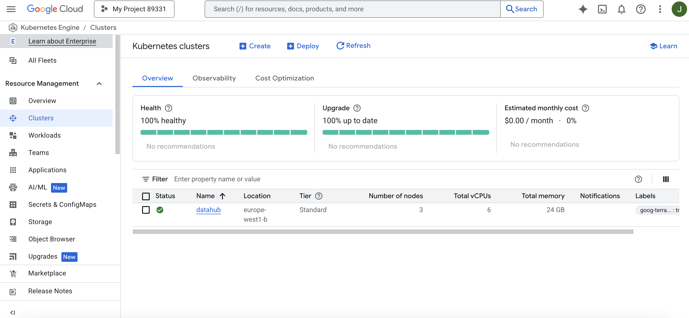
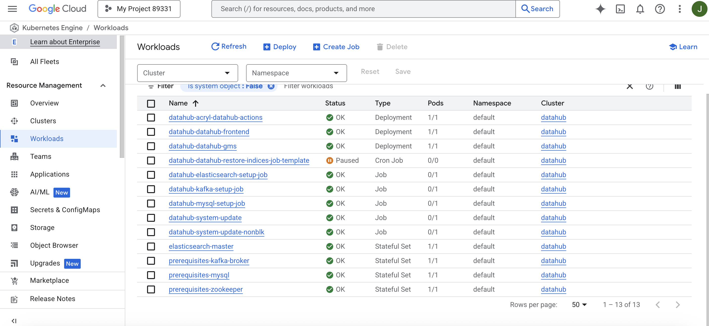
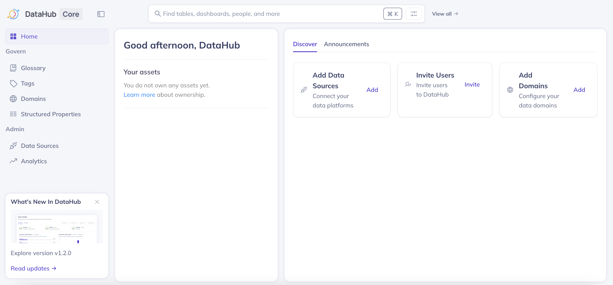

# DataHub on GCP/GKE - Terraform Example

This repository contains example Terraform code for deploying [DataHub](https://datahubproject.io/) on Google Cloud Platform (GCP) using Google Kubernetes Engine (GKE). This is intended for development and testing purposes.



## Overview

This Terraform configuration will provision:
- GKE cluster with worker nodes
- DataHub prerequisites (MySQL, Elasticsearch, Neo4j, etc.)
- DataHub application via Helm charts
- Kubernetes secrets for database credentials
- Ingress configuration for external access

## Prerequisites

- [Terraform](https://terraform.io) >= 1.12.2
- [Google Cloud SDK](https://cloud.google.com/sdk) configured with appropriate permissions
- GCP project with billing enabled
- Kubernetes CLI (`kubectl`) for cluster management

## Required GCP APIs

The following APIs will be automatically enabled:
- Compute Engine API
- Kubernetes Engine API

## Project Structure

```
├── main.tf             # Main Terraform configuration and providers
├── variables.tf        # Variable definitions
├── variables.tfvars    # Variable values (customize this)
├── gke.tf              # GKE cluster and Kubernetes resources
├── vpc.tf              # VPC and networking configuration
├── helm.tf             # Helm provider and DataHub chart deployments
├── backend.tf          # Terraform state backend configuration
├── datahub.yaml        # DataHub Helm chart values with custom user authentication
├── values.yaml         # Default DataHub Helm chart values (reference)
├── user.props          # DataHub user credentials configuration
└── backend.conf        # Backend configuration file
```

## Configuration

### 1. Update Variables

Create [`variables.tfvars`](variables.tfvars) with your specific values:

```hcl
project = "your-gcp-project-id"
region  = "us-central1"
zone    = "us-central1-b"
cluster_name = "datahub"
mysqlRootPassword = "your-mysql-password"
neo4jPassword = "your-neo4j-password"
vpc_name = "datahub-vpc"
subnet_name = "datahub-subnet"
```

### 2. Configure Backend

Create the backend configuration file [`backend.conf`](backend.conf) if using a remote state backend (e.g., Google Cloud Storage):

```hcl
bucket = "your-terraform-state-bucket"
prefix = "datahub/terraform/state"
```

Another option is to use local state by removing the backend configuration in [`backend.tf`](backend.tf).

### 3. Customize DataHub Configuration

This project uses [`datahub.yaml`](datahub.yaml) as the primary Helm chart values file, which includes:
- Custom user authentication mounting [`user.props`](user.props) as a volume
- Resource limits and configuration optimized for GKE
- Integration with the provisioned infrastructure

The [`values.yaml`](values.yaml) file contains the default DataHub Helm chart values for reference.

To customize the default user credentials, edit [`user.props`](user.props):
```
datahub:your-custom-password
```

## Deployment

### 1. Initialize Terraform

```bash
terraform init
```

If using remote backend:
```bash
terraform init -backend-config="./backend.conf"
```

### 2. Plan Deployment

```bash
terraform plan -var-file="variables.tfvars"
```

### 3. Apply Configuration

```bash
terraform apply -var-file="variables.tfvars"
```

The deployment includes:
1. GKE cluster provisioning (from [`gke.tf`](gke.tf))
2. DataHub prerequisites installation (from [`helm.tf`](helm.tf))
3. DataHub application deployment
4. Ingress setup for external access



### 4. Access DataHub

Once deployed, DataHub will be accessible via the configured ingress IP or domain name  (update the host in [`gke.tf`](gke.tf) as needed). You can find the ingress details by running:

```bash
kubectl get ingress
``` 
Or by checking the GKE console for the external IP address of the ingress resource.



## Components

### Infrastructure
- **GKE Cluster**: Managed Kubernetes cluster with `e2-standard-2` nodes
- **VPC**: Custom networking setup (defined in [`vpc.tf`](vpc.tf))
- **Secrets**: Kubernetes secrets for MySQL, Neo4j, and user authentication


### DataHub Stack
- **Prerequisites**: MySQL, Elasticsearch, Neo4j (via `datahub-prerequisites` Helm chart)
- **DataHub GMS**: Metadata service with 2Gi memory limit
- **DataHub Frontend**: Web UI accessible via ingress

## Important Notes

⚠️ **This is example code for development purposes only**

- Default recommended configuration from DataHub documentation uses `e2-standard-2` machine types
- Preemptible instances are commented out but available
- No TLS/SSL configuration included
- Basic ingress setup without advanced security

## Cleanup

To destroy all resources:

```bash
terraform destroy -var-file="variables.tfvars"
```

## Customization

### Scaling
- Modify machine types in [`gke.tf`](gke.tf)
- Adjust resource limits in [`datahub.yaml`](datahub.yaml)
- Configure auto-scaling parameters

### Security
- Enable TLS for ingress
- Configure network policies
- Set up proper RBAC

### Monitoring
- Add monitoring and logging configurations
- Configure alerts and dashboards

## Troubleshooting

### Common Issues
1. **Timeout during Helm installation**: Increase timeout in [`helm.tf`](helm.tf)
2. **Resource constraints**: Adjust memory/CPU limits in [`datahub.yaml`](datahub.yaml)
3. **Access issues**: Verify ingress configuration and DNS settings

### Useful Commands
```bash
# Get cluster credentials
gcloud container clusters get-credentials <cluster-name> --region <region>

# Check pod status
kubectl get pods

# View DataHub logs
kubectl logs -l app=datahub-gms
```

## Contributing

This is example code. For production deployments, consider:
- Adding proper backup strategies
- Implementing security best practices
- Setting up monitoring and alerting
- Configuring disaster recovery

## License

This project is provided as-is for educational and development purposes.